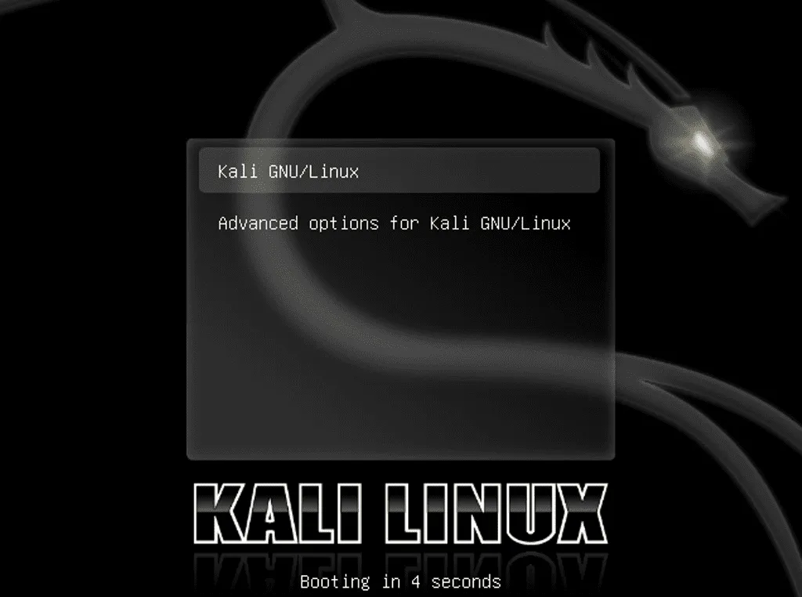
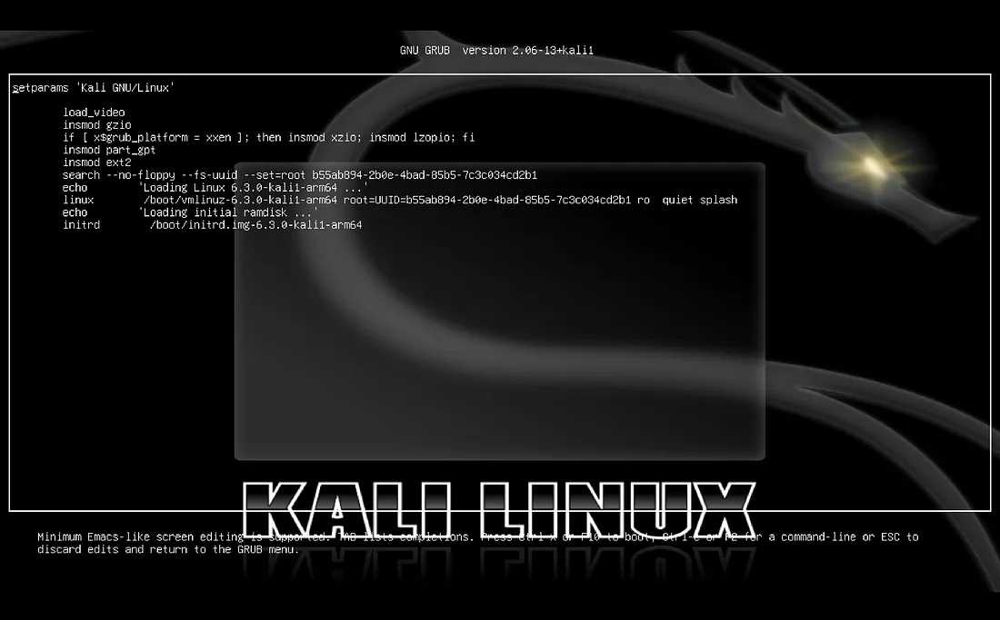
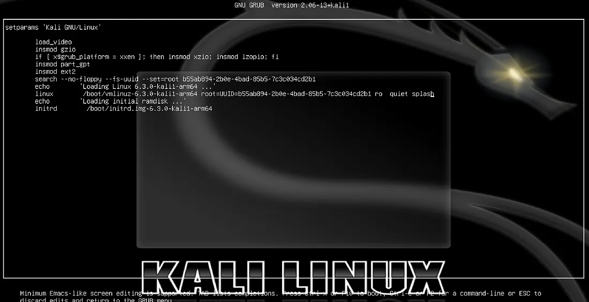
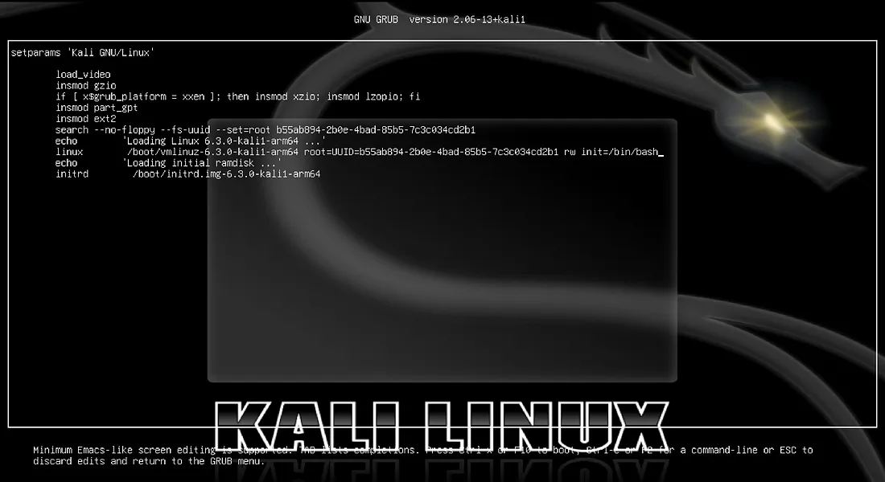
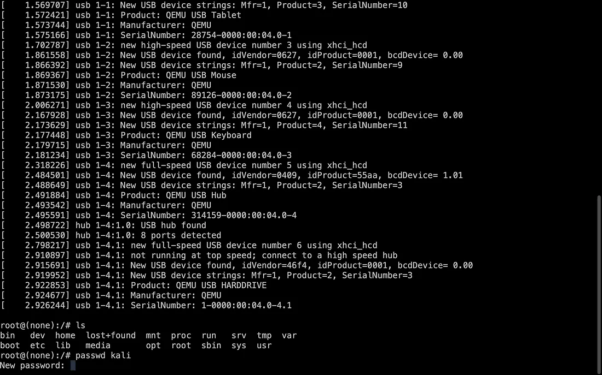
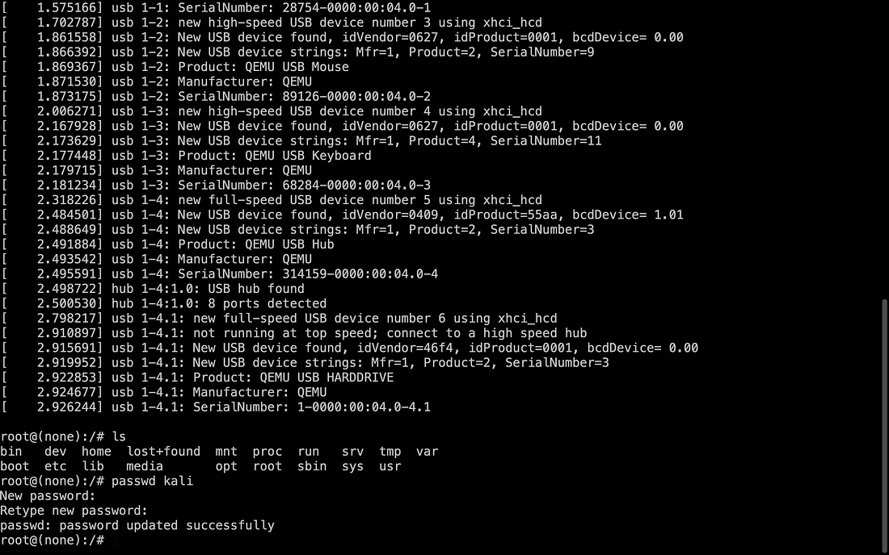
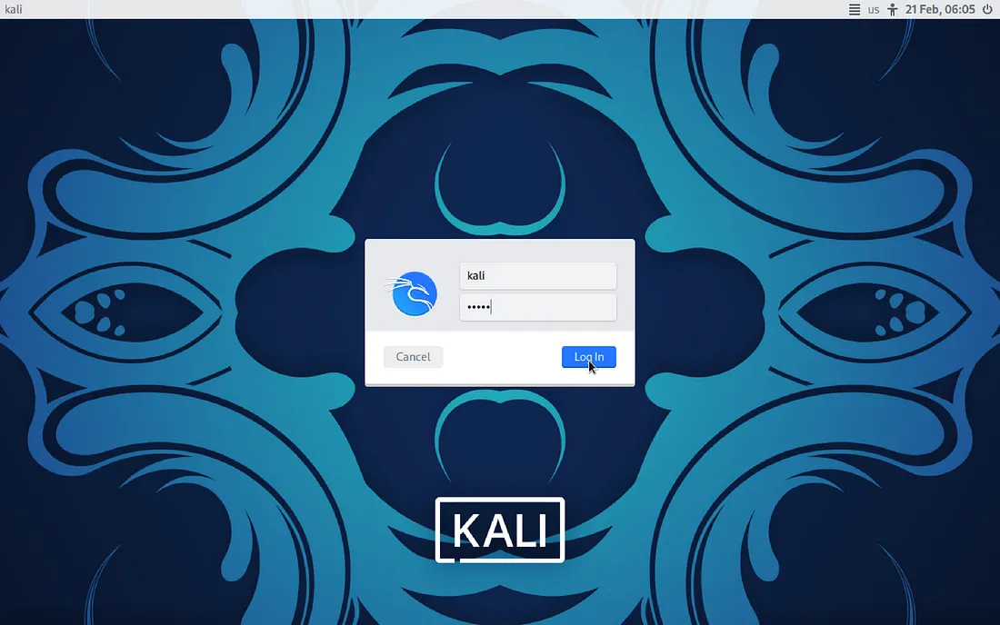

# Reset Forgotten Password on Kali Linux in VM or Dual Boot

### **Step 1: Open the Boot Screen**
When you start your computer, you will see the **Boot Screen**.



---

### **Step 2: Open GRUB (Bootloader)**
GRUB (**Grand Unified Bootloader**) is responsible for initiating the operating system during startup. To access it:

**Press `e`** to open the GRUB menu.



---

### **Step 3: Modify the Boot Parameters**
You need to change the boot parameters.

#### **Before Modification:**


#### **Modify This Line:**
Replace **`ro quiet splash`** with **`rw init=/bin/bash`**:

```bash
# Original
ro quiet splash 

# Modified
rw init=/bin/bash
```
- **`ro`** → Read-only mode  
- **`rw`** → Read & write mode  

Now, **press `CTRL + X`** to exit the GRUB menu and boot into the modified mode.

#### **After Modification:**


---

### **Step 4: Add a New Password**
After exiting the GRUB menu, the **root shell prompt** (a terminal with superuser access) will appear.

#### **Find Your Username**
Run the following command to check available users:

```bash
ls /home
```

#### **Change the Password**
Replace **`username`** with your actual username and set a new password:

```bash
passwd username
```





---

### **Step 5: Reboot the System**
After resetting the password, reboot your system by typing the following command:

```bash
reboot -f
```
- **`-f`** → Forces an immediate reboot.

Now, log in to your Kali Linux system with your new password!

